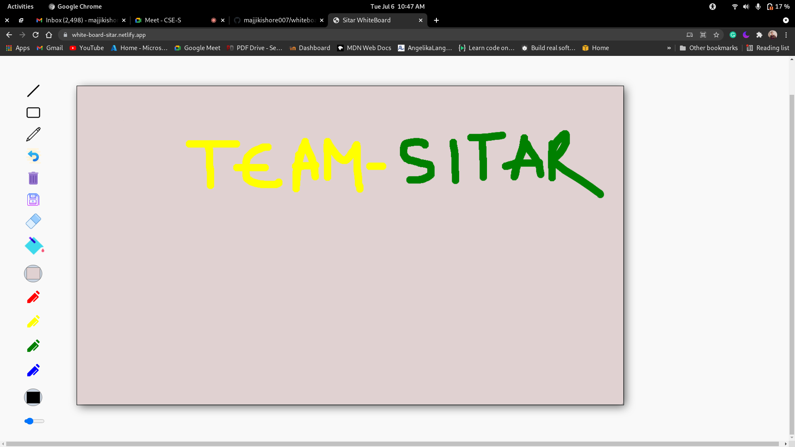

<!-- Please update value in the {}  -->

<h1 align="center">White board (Team sitar)</h1>

  <h3>
    <a href="https://white-board-sitar.netlify.app/">
      Demo
    </a>
     | 
    <a href="https://github.com/majjikishore007/whiteboard">
      Solution
    </a>
  </h3>

<!-- TABLE OF CONTENTS -->

## Table of Contents

- [Overview](#overview)
  - [Built With](#built-with)
- [Features](#features)
- [Contact](#contact)

<!-- OVERVIEW -->

## Overview

### Built With

<!-- This section should list any major frameworks that you built your project using. Here are a few examples.-->

- Html
- Html canvas
- css

## Features

<!-- List the features of your application or follow the template. Don't share the figma file here :) -->

This application/site was created as a submission to a [Devsnest](https://www.devsnest.in/) challenge. The [challenge](https://devchallenges.io/challenges/wBunSb7FPrIepJZAg0sY) was to build an white application with features like

- tool for drawing diffrent shapes and lines
- a pen tool with multicolors
- background filler tool
- color picker tool
- download the content  tool

## Contact

<h1>powered by team Sitar</h1>
